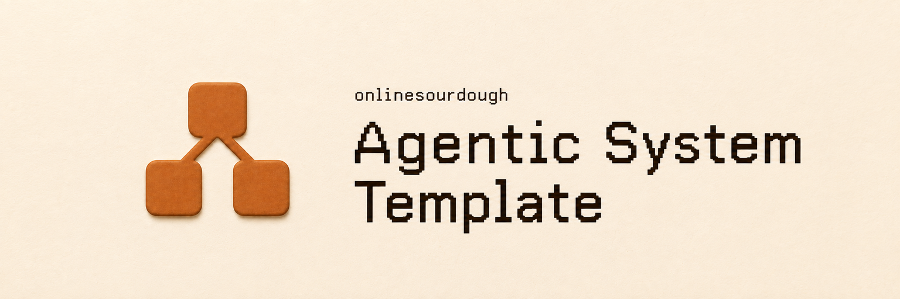
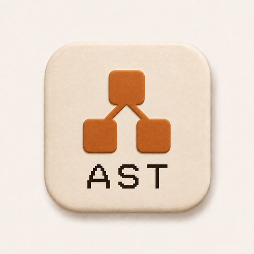

# Agentic System Template

<a href="assets/branding/system-icon.png"></a>

Agentic System Template is a small, instruction-owned seed for persistent
Agentic Systems. It explains the ownership and operating boundaries without
shipping a generic implementation that every concrete System would inherit.

## When a System is justified

AIOS has three first-class concepts: Space, System, and Project. Templates and
Skills are supporting constructs.

Use a Skill when the reusable value is an instruction or method with clear
inputs, proof, and stop conditions but no independent operational
responsibility. Use a System when a reusable capability must remain
independently operable across runs and outcomes and materially owns several
responsibilities as one cohesive capability.

## What the concrete System owns

Establish only the surfaces required by the actual capability:

- its domain responsibilities and repeatable operations;
- the owner-local workspace truth needed to continue operating;
- evidence and proof for consequential outputs or checkpoints;
- System-local evaluation criteria tied to observable requirements;
- retained failure evidence and an explicit correction/recovery path when
  failures matter to future operation; and
- read-only accumulated-state and currentness criteria where drift matters.

Those needs do not imply a universal workspace layout, ledger, schema,
database, runtime, or audit rubric. The owning System chooses the smallest
durable form that makes its own work operable and inspectable.

## Operating decisions and proof

Each concrete System owns its material decisions, operational documentation,
proof, and recovery in the source-of-truth records it chooses. Those records
retain decision context, rationale, consequences, and supersession history when
the decision changes; the template prescribes neither an ADR format nor a
directory.

The [primary System method](.agents/skills/agentic-system-template/SKILL.md#method)
is the canonical procedure for decisions, representative defect or domain proof,
honest handback evidence, and sensitive-data safeguards. Its software and data
directions apply only when those responsibilities exist, so a concrete
non-software System does not inherit browser E2E, a database, or a generic
lifecycle framework.

## Instruction surface

```text
AGENTS.md
README.md
.agents/skills/agentic-system-template/SKILL.md
.agents/skills/audit-system/SKILL.md
```

`agentic-system-template` is the primary route for establishing or maintaining
a concrete System. `audit-system` is a separate read-only inspection route.
Both are instructions only and require no bundled engine or AIOS runtime.

## Adoption and ownership

A concrete System explicitly adopts the useful boundary, then owns its skills,
state, criteria, evidence, and evolution. This template does not become a
dependency, synchronize downstream copies, or overwrite owner-local behavior
later. Cross-project and Global Skills stay outside the repository in the
harness or plugin that provides them.
